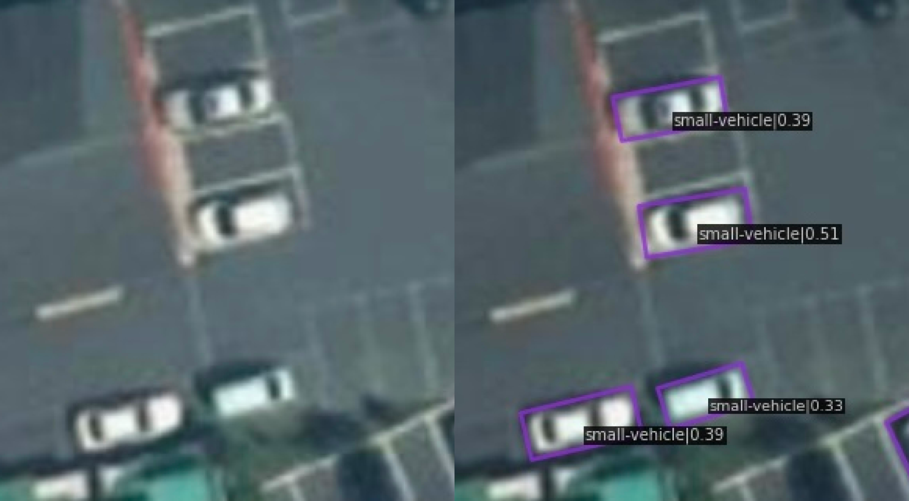
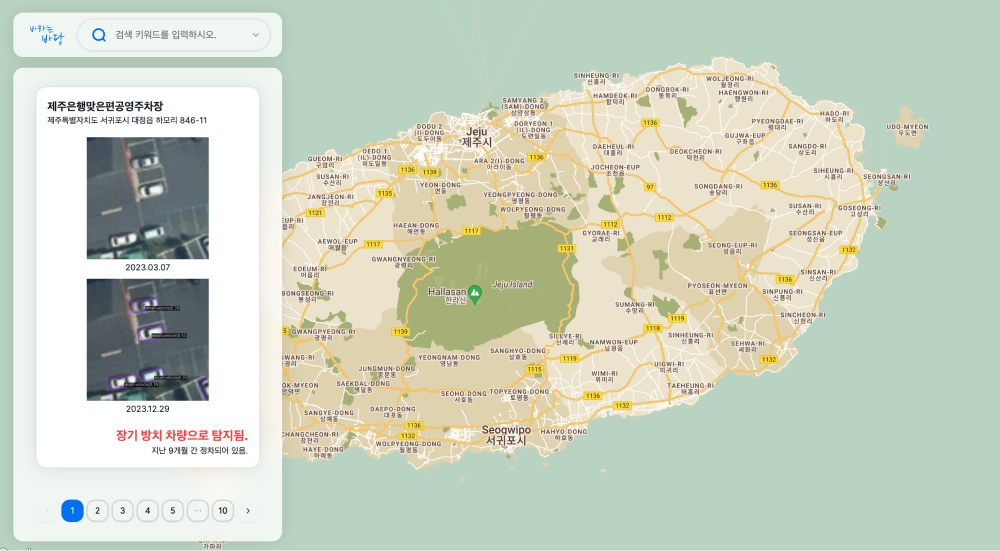
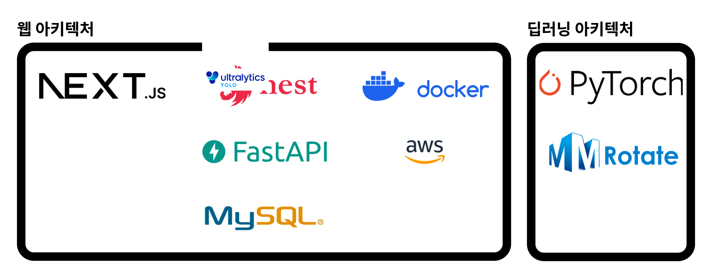
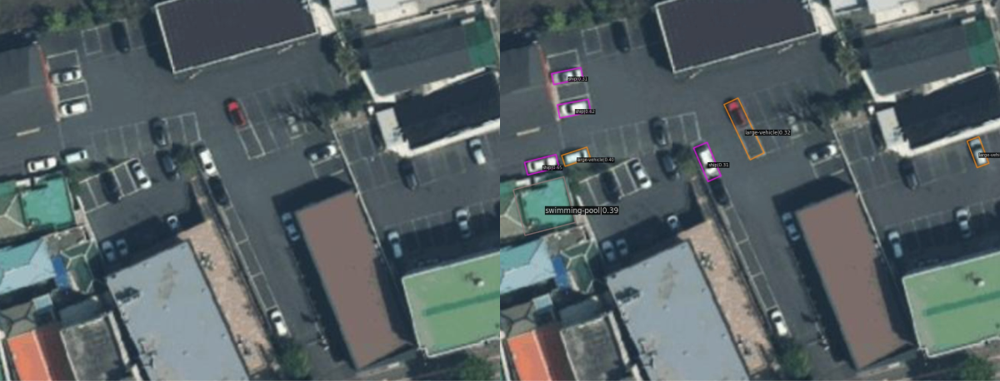

# Hello, BaDang

**제주위성데이터를 활용한 장기방치차량 탐지 지능형 플랫폼**  
"Intelligent Platform for Long-Term Abandoned Vehicle Detection Utilizing Jeju Satellite Data"

<p align="left">
  
  
  
  <br/>
  
  
  
  
  
  
</p>
<br/>


***아래의 뱃지에서 프로토타입을 확인해보세요.***

<p align="left">
  <a href='https://desirable-sea.vercel.app/' target="_blank">
    
  </a>
  <a href='https://goor.me/sNAKy6hRhoZnGsCj6' target="_blank">
    
  </a>
</p>

* Webpage - 프론트엔드 개발 완료. 메인 서버와 딥러닝 서버를 구분하여 개발 중에 있음.

* Modeling - 아래의 프로덕트 > 모델링 > 추론 실행방법을 참고하여, 베이스라인을 기반으로 한 MVP 시연이 가능함.
<br/>

# 1. 프로젝트 개요
본 아이디어는, 제주 위성데이터를 활용하고 컴퓨터 비전의 객체 인식 AI 기술을 적용하여, 제주 지역에서 장기적으로 주차되거나 방치되어 있는 차량을 탐지하고, 해당 정보를 유관 기관이 통합하여 관리할 수 있는 지능형 플랫폼을 연구 및 개발하는 것입니다. 이를 통해 장기 방치 차량의 전수조사에 소요되는 인력과 시간을 절약하고 제주 미래항공우주산업 육성을 위한 첫걸음이 되기를 기대합니다.


<table>
  <tr>
    <td>
      <p align='center'>딥러닝 모델링 시연 결과</p>
    </td>
    <td>
      <p align='center'>
        사용자 UX 개발 내용
      </p>
    </td>
  </tr>
   <tr>
    <td>
      
    </td>
    <td>
      
    </td>
  </tr>
</table>
<br/>


# 2. 프로덕트

## 아키텍처



## 모델링

디렉토리 구조
```
desirable-sea
├── checkpoints
├── mmrotate
│   ├── config
│   ├── ...
│   └── demo
├── ...
├── demo.png
└── result.jpg
```

### 초기 설치방법
1. setup.sh 파일 만들기.
2. 아래의 쉘스크립트 복사 후 붙여넣기.
3. 터미널에서 setup.sh 실행

```shell
# this code is written in Linux.

sudo apt update
sudo apt -y install libgl1-mesa-glx

wget https://repo.anaconda.com/miniconda/Miniconda3-py37_4.9.2-Linux-x86_64.sh
chmod +x Miniconda3-py37_4.9.2-Linux-x86_64.sh
bash ./Miniconda3-py37_4.9.2-Linux-x86_64.sh -b -f -p /usr/local
which conda
conda --version

pip install torch==1.7.0+cu110 torchvision==0.8.1+cu110 torchaudio==0.7.0 -f https://download.pytorch.org/whl/torch_stable.html
pip install openmim --use-feature=2020-resolver
mim install mmcv-full==1.5.3
mim install mmdet==2.25.1

git clone https://github.com/open-mmlab/mmrotate.git
cd mmrotate
pip install -r requirements/build.txt
pip install -v -e .

cd ..


mkdir checkpoints
cd checkpoints
wget https://download.openmmlab.com/mmrotate/v0.1.0/rotated_retinanet/rotated_retinanet_obb_r50_fpn_1x_dota_ms_rr_le90/rotated_retinanet_obb_r50_fpn_1x_dota_ms_rr_le90-1da1ec9c.pth
cd ..

wget https://raw.githubusercontent.com/ziweek/desirable-sea/main/src/demo.png

```

### 추론 실행방법
1. 아래의 쉘스크립트 복사 후 터미널에 붙여넣기.
2. 터미널에서 실행하기.
3. 동일 디렉토리 내에서 result.jpg 파일 확인하기.

```shell
python mmrotate/demo/image_demo.py demo.png mmrotate/configs/rotated_retinanet/rotated_retinanet_obb_r50_fpn_1x_dota_ms_rr_le90.py checkpoints/rotated_retinanet_obb_r50_fpn_1x_dota_ms_rr_le90-1da1ec9c.pth --out-file result.jpg
```

<br/>

## 웹페이지


<br/>

# Contribute


<table>
  <tr>
    <td>
      <p align='center'>김지욱</p>
    </td>
    <td>
      <p align='center'>부선웅</p>
    </td>
  </tr>
   <tr>
    <td>
      
    </td>
    <td>
      
    </td>
  </tr>
  <tr>
    <td>
      <p align='center'>
        <a href='' target="_blank">
          
        </a>
      </p>
    </td>
    <td>
      <p align='center'>
        <a href='' target="_blank">
          
        </a>
      </p>
    </td>
  </tr>
</table>


