# Hello, BaDang
 
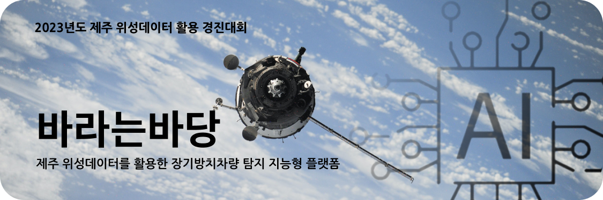

<p align="center">
  <strong>🏆 2023 제주특별자치도 도지사상 수상 작품 🏆</strong>
  <br/>
  <br/>
  <a href='https://github.com/ziweek/desirable-sea/blob/main/README.md'>
    KOREAN
  </a>
  &nbsp;|&nbsp;
  <a href='https://github.com/ziweek/desirable-sea/blob/main/README_EN.md'>
    ENGLISH
  </a>
  <br/>
  <br/>
  <strong>제주 위성데이터를 활용한 장기방치차량 탐지 지능형 플랫폼</strong>
  <br/>
  <strong>Intelligent Platform for Long-Term Abandoned Vehicle Detection Utilizing Jeju Satellite Data</strong>
  <br/>
  <br/>

  <a href='https://paperswithcode.com/task/image-super-resolution'>
    
  </a>
  <a href='https://github.com/XPixelGroup/HAT'>
    
  </a>
  <a href='https://github.com/xinntao/ESRGAN?tab=readme-ov-file'>
    
  </a>
  
  </br>
  
  <a href='https://paperswithcode.com/task/object-detection-in-aerial-images'>
    
  </a>
  <a href='https://github.com/open-mmlab/mmrotate'>
    
  </a>
  <a href='https://github.com/ZFTurbo/Weighted-Boxes-Fusion'>
    
  </a>
  <br/>

  
  
   
  
  
  
  
  
  
  
  
</p>
<br/>
<br/>
  
<p align="center">  
  <strong>아래의 뱃지에서 프로토타입을 확인해보세요.<strong>
  <br/>
  <br/>
  <a href='https://desirable-sea.vercel.app/'>
    
  </a>
  <a href='https://goor.me/edkv2g6bKZt7nopy6'>
    
  </a>
  <a href='https://colab.research.google.com/drive/13-VZyx3LiYPRS8aw-AcMSBK0Z4--TF2j?usp=sharing'>
    
  </a>
</p>

<br/>
<br/>

# 1. 개요

> [!NOTE]
> - 본 아이디어는, 제주특별자치도에서 주최하는 [2023년도 제주 위성데이터 활용 경진대회](https://aifactory.space/task/2700/overview)에 출품하여 대상(제주특별자치도지사상)을 수상한 프로젝트입니다.
>   
> - 본 아이디어는, 제주 위성데이터를 활용하고 컴퓨터 비전의 객체 인식 AI 기술을 적용하여, 제주 지역에서 장기적으로 주차되거나 방치되어 있는 차량을 탐지하고, 해당 정보를 유관 기관이 통합하여 관리할 수 있는 지능형 플랫폼을 연구 및 개발하는 것입니다.

https://github.com/ziweek/desirable-sea/assets/99459331/4a7edb47-754c-47fd-8dab-7d2adbb045ec

<table>
  <tr>
     <td>
      <p align='center'>
        초고상도 이미지 개선 모델
      </p>
    </td>
    <td>
      <p align='center'>
        소형 객체 인식 모델링
      </p>
    </td>
    <td>
      <p align='center'>
        프로덕트 웹페이지
      </p>
    </td>
  </tr>
   <tr>
    <td style="width:1/3;">
      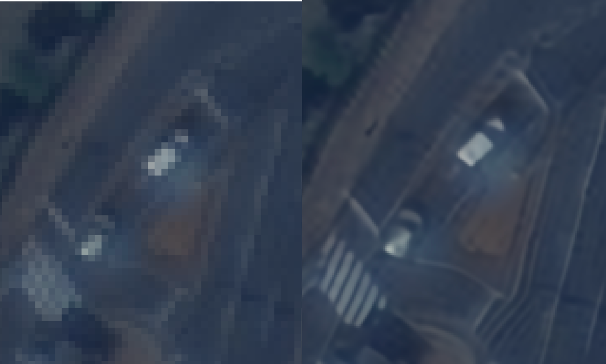
    </td>
    <td style="width:1/3;">
      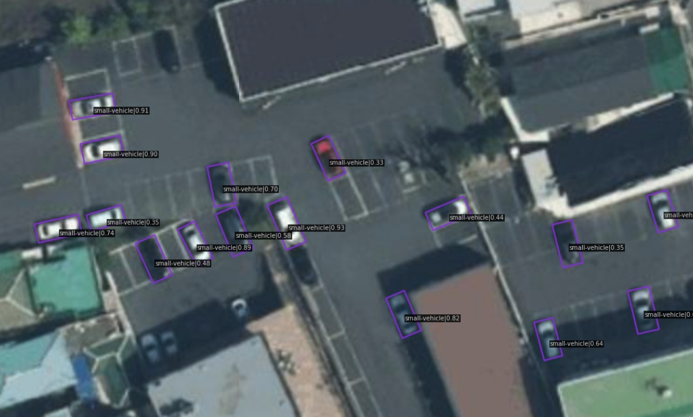
    </td>
    <td style="width:1/3;">
      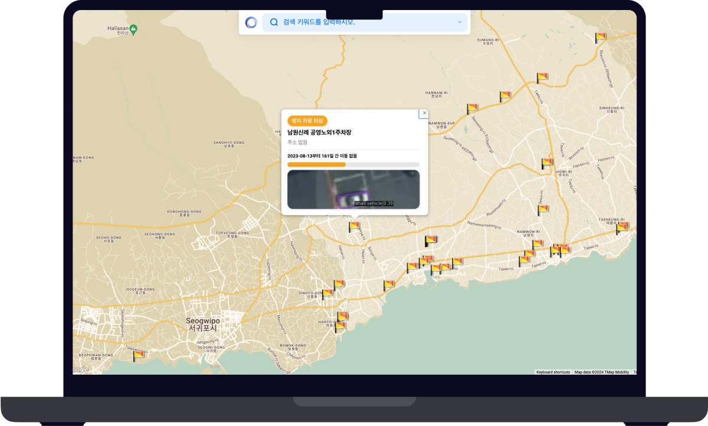
    </td>
  </tr>
</table>
<br/>

<br/>
<br/>


# 2. 프로덕트


> [!IMPORTANT]
> <details> <summary><b>프로젝트 진행 현황</b></summary>
> <br/>
>
> - [x] 기획안 작성 완료 :ok_hand:
> - [x] 프론트엔드 개발 완료 :ok_hand:
> - [x] 벡엔드 개발 완료 :ok_hand:
> - [x] 머신러닝 서버 개발 완료 :ok_hand:
> - [x] 데이터베이스 구축 완료 :ok_hand:
> - [x] 소개자료 및 시연영상 제작 완료 :ok_hand:
>
> </details>

> [!tip]
> <details> <summary><b>프로토타입 설치 방법</b></summary>
> <br/>
>
> iOS에서 설치하는 방법:
>
>  1. iOS 기기에서 Safari를 열고 [PWA가 호스팅된 URL](https://desirable-sea.vercel.app/)로 이동합니다.
>  2. 화면 하단에 있는 공유 아이콘을 탭합니다.
>  3. 화면을 아래로 스크롤하여 "홈 화면에 추가"를 탭합니다.
>  4. 우측 상단의 "추가"를 탭합니다.
>
> Android에서 설치하는 방법:
> 
>  1. Android 기기에서 Chrome 브라우저를 열고 [PWA가 호스팅된 URL](https://desirable-sea.vercel.app/)로 이동합니다.
>  2. 화면 우측 상단의 세 점 메뉴를 탭합니다.
>  3. "홈 화면에 추가"를 탭합니다.
>  4. 우측 상단의 "추가"를 탭합니다.
> </details>


<details >
 <summary><b>핵심기능</b></summary><br/>

 <table>
  <tr>
     <td width="50%">
      <p align="center">1. 초고해상도 이미지 개선 딥러닝 모델</p>
    </td>
     <td>
    </td>
  </tr>
   <tr>
     <td width="50%">
      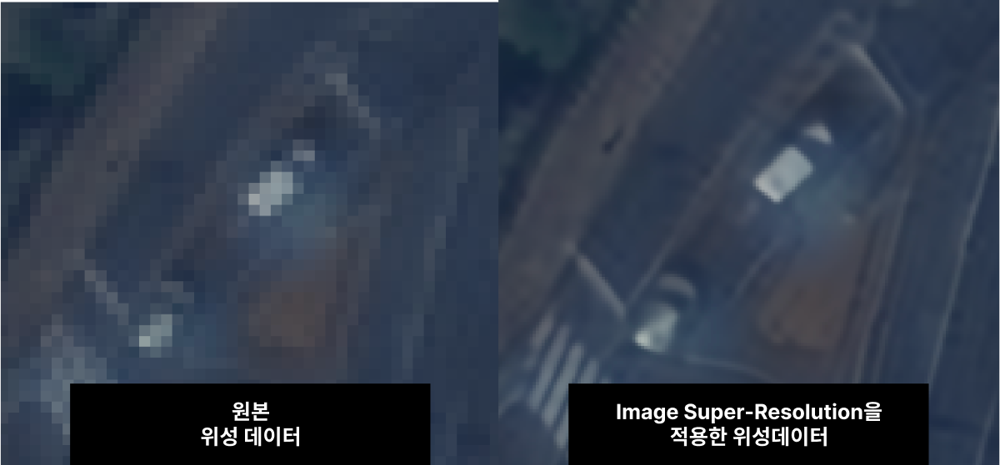
    </td>
    <td>
     <p align="left">1.1 초고해상도 이미지 개선 딥러닝 모델</p>
     <p align="left">데이터 전처리 과정에서 초고해상도 이미지 개선 딥러닝 모델을 원본 데이터에 적용하여 해상도를 크게 개선할 수 있었습니다.</p>
    </td>
  </tr>
   <tr>
    <td width="50%">

     
https://github.com/ziweek/desirable-sea/assets/99459331/2212ce20-bb1b-42f8-a97c-bebd22ce3fb3


</td>
     <td>
      <p align="left">1.2 초고해상도 이미지 개선 딥러닝 모델</p>
      <p align="left">전처리된 데이터셋을 라벨링하였습니다. 이때, 사전학습된 모델을 활용하여 자동으로 식별하게 하였고, 아래와 같이 예외적인 경우에는 수작업을 병행하였습니다.</p>
    </td>
    </tr>
</table>


<br/>
<br/>


 <table>
  <tr>
     <td width="50%">
      <p align="center">2. 소형 객체 탐자 딥러닝 모델</p>
    </td>
     <td width="50%">
    </td>
  </tr>
   <tr>
     <td width="50%">
      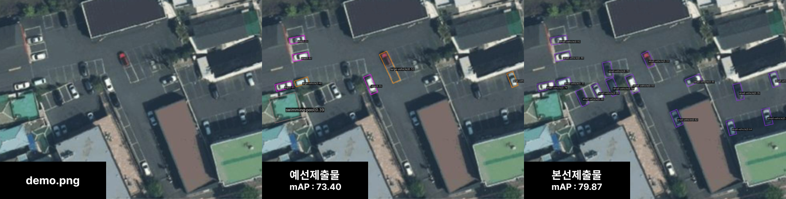
    </td>
    <td width="50%">
      <p align="left">2.1 객체 탐식 딥러닝 모델 도입</p>
      <p align="left">데이터 전처리 과정에서 초고해상도 이미지 개선 딥러닝 모델을 원본 데이터에 적용하여 해상도를 크게 개선할 수 있었습니다.</p>
    </td>
  </tr>
    <tr>
     <td width="50%">
      
    </td>
     <td width="50%">
      <p align="left">2.2 WBF 앙상블 기법으로 성능 개선</p>
      <p align="left">전처리된 데이터셋을 라벨링하였습니다. 이때, 사전학습된 모델을 활용하여 자동으로 식별하게 하였고, 아래와 같이 예외적인 경우에는 수작업을 병행하였습니다.</p>
    </td>
  </tr>
</table>


<br/>
<br/>


 <table>
  <tr>
     <td width="50%">
      <p align="center">3. 사용자 경험</p>
    </td>
     <td width="50%">
    </td>
  </tr>
   <tr>
     <td width="50%">
      
    </td>
    <td width="50%">
     <p align="left">3.1 Google Map API를 활용한 UX 구현</p>
     <p align="left">데이터 전처리 과정에서 초고해상도 이미지 개선 딥러닝 모델을 원본 데이터에 적용하여 해상도를 크게 개선할 수 있었습니다.</p>
    </td>
  </tr>
    <tr>
     <td width="50%">
      
    </td>
     <td width="50%">
      <p align="left">3.2 반응형 UI 및 다크모드 지원으로 사용성 개선</p>
      <p align="left">전처리된 데이터셋을 라벨링하였습니다. 이때, 사전학습된 모델을 활용하여 자동으로 식별하게 하였고, 아래와 같이 예외적인 경우에는 수작업을 병행하였습니다.</p>
    </td>
  </tr>
</table>
<br/>
<br/>
</details>


<details >
  <summary><b>아키텍처</b></summary><br/>

 <table>
  <tr>
     <td width="50%">
      <p align="center">프로덕트 아키텍처</p>
    </td>
     <td width="50%">
    </td>
  </tr>
   <tr>
     <td width="50%">
      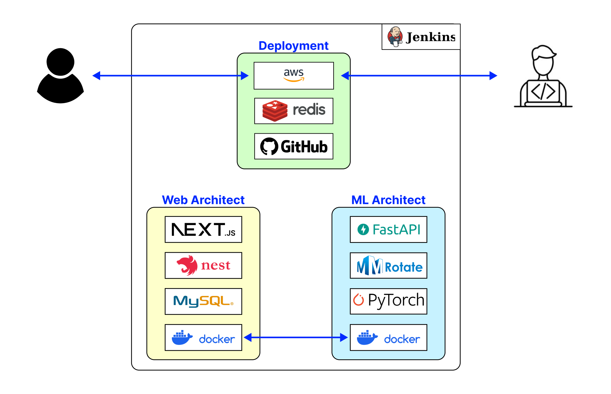
    </td>
    <td width="50%">
           <p align="left">본 프로젝트의 아키텍처는 데이터 전처리 수행 서버(초고해생도 이미지 개선 딥러닝 모델), 핵심 기능 수행 서버(소형 객체 식별 딥러닝 모델), 그리고 웹 어플리케이션(프론트엔드와 벡엔드 및 데이터베이스)으로 구성되어 있습니다.</p>
    </td>
  </tr>
</table>


<br/>
<br/>


<table>
  <tr>
     <td width="50%">
      <p align="center">AI 아키텍처</p>
    </td>
     <td width="50%">
    </td>
  </tr>
   <tr>
     <td width="50%">
      
    </td>
    <td width="50%">
     <p align="left">전처리된 데이터셋을 라벨링하였습니다. 이때, 사전학습된 모델을 활용하여 자동으로 식별하게 하였고, 아래와 같이 예외적인 경우에는 수작업을 병행하였습니다.</p>
    </td>
  </tr>
</table>


</details>


<br/>
<br/>


<!--

## 2.2 초고해상도 이미지 개선 모델

<details >
  <summary><b>디렉토리 구조</b></summary>
  
```
ESRGAN
├── LR                      # Pytorch 모델을 저장하는 폴더입니다.
│   └── demo.png            # MVP 시연에 사용될 데모 이미지입니다.
├── models
│   ├── ...
│   └── RRDB_ESRGAN_x4.pth  # 베이스라인 관련 코드입니다.
├── ...
└── results
    └── demo_rlt.png        # 모델링 결과로 출력되는 이미지입니다.
```
</details>

<details >
  <summary><b>초기 설치방법</b></summary>

1. setup.sh 파일 만들기.
2. 아래의 쉘스크립트 복사 후 붙여넣기.
3. 터미널에서 setup.sh 실행


```shell

git clone https://github.com/xinntao/ESRGAN
cd ESRGAN

cd models
wget --load-cookies ~/cookies.txt "https://docs.google.com/uc?export=download&confirm=$(wget --quiet --save-cookies ~/cookies.txt --keep-session-cookies --no-check-certificate 'https://docs.google.com/uc?export=download&id=1TPrz5QKd8DHHt1k8SRtm6tMiPjz_Qene' -O- | sed -rn 's/.*confirm=([0-9A-Za-z_]+).*/\1\n/p')&id=1TPrz5QKd8DHHt1k8SRtm6tMiPjz_Qene" -O RRDB_ESRGAN_x4.pth && rm -rf ~/cookies.txt
cd ..

cd LR
wget https://raw.githubusercontent.com/ziweek/desirable-sea/main/src/demo.png
cd ..
```
</details>


<details >
  <summary><b>추론 실행방법</b></summary>

1. 아래의 쉘스크립트 복사 후 터미널에 붙여넣기.
2. 터미널에서 실행하기.
3. 동일 디렉토리 내에서 result-resolution.jpg 파일 확인하기.

```shell
python test.py
```


</details>

## 2.3 소형 객체 인식 모델


- 성능지표가 크게 개선됨. (mAP : 73.4 -> 78.9 )
  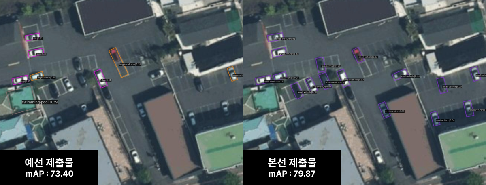
- 기존의 결과값에 비해 정확도 및 신뢰도가 대폭 상승함. (ship 30% -> small vehicle 91%)
  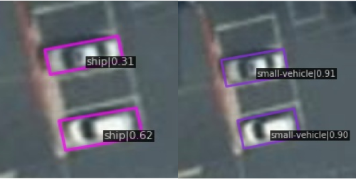
- 기존의 모델이 흰색 차량만을 식별했던 것과 달리 검은색, 검은색의 차량도 식별함.
  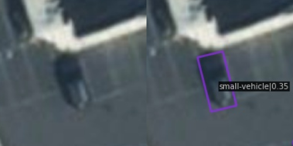
- 건물의 그림자가 걸쳐진 차량도 식별함.
  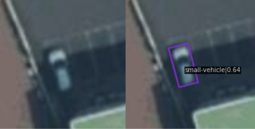


<details >
  <summary><b>디렉토리 구조</b></summary>
  
```
desirable-sea
├── checkpoints  # Pytorch 모델을 저장하는 폴더입니다.
├── mmrotate     # 베이스라인 관련 코드입니다.
│   ├── config
│   ├── ...
│   └── demo
├── ...
├── demo.png     # MVP 시연에 사용될 데모 이미지입니다.
└── result.jpg   # 모델링 결과로 출력되는 이미지입니다.
```
</details>

<details >
  <summary><b>초기 설치방법</b></summary>

1. setup.sh 파일 만들기.
2. 아래의 쉘스크립트 복사 후 붙여넣기.
3. 터미널에서 setup.sh 실행

```shell
# this code is written in Linux.

sudo apt update
sudo apt -y install libgl1-mesa-glx

wget https://repo.anaconda.com/miniconda/Miniconda3-py37_4.9.2-Linux-x86_64.sh
chmod +x Miniconda3-py37_4.9.2-Linux-x86_64.sh
bash ./Miniconda3-py37_4.9.2-Linux-x86_64.sh -b -f -p /usr/local
which conda
conda --version

pip install torch==1.7.0+cu110 torchvision==0.8.1+cu110 torchaudio==0.7.0 -f https://download.pytorch.org/whl/torch_stable.html
pip install openmim --use-feature=2020-resolver
mim install mmcv-full==1.5.3
mim install mmdet==2.25.1

git clone https://github.com/open-mmlab/mmrotate.git
cd mmrotate
pip install -r requirements/build.txt
pip install -v -e .

cd ..


mkdir checkpoints
cd checkpoints
wget https://download.openmmlab.com/mmrotate/v0.1.0/redet/redet_re50_fpn_1x_dota_ms_rr_le90/redet_re50_fpn_1x_dota_ms_rr_le90-fc9217b5.pth
cd ..

wget https://raw.githubusercontent.com/ziweek/desirable-sea/main/src/demo.png

```
</details>


<details >
  <summary><b>추론 실행방법</b></summary>

1. 아래의 쉘스크립트 복사 후 터미널에 붙여넣기.
2. 터미널에서 실행하기.
3. 동일 디렉토리 내에서 result.jpg 파일 확인하기.

```shell
python mmrotate/demo/image_demo.py demo.png mmrotate/configs/redet/redet_re50_refpn_1x_dota_ms_rr_le90.py checkpoints/redet_re50_fpn_1x_dota_ms_rr_le90-fc9217b5.pth --out-file result.jpg
```


</details>

## 2.4 웹 어플리케이션

- 공공데이터 포털에서 제공하는 [제주특별자치도_주차장기본정보](https://www.data.go.kr/data/15099715/openapi.do) 사용함.
  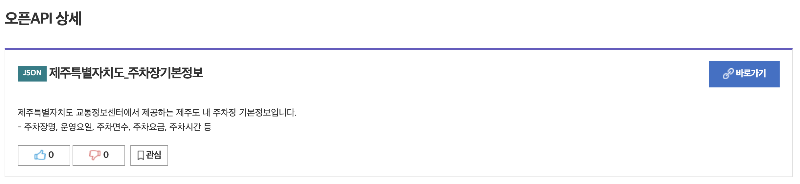
- 서버와 데이터베이스 연동
  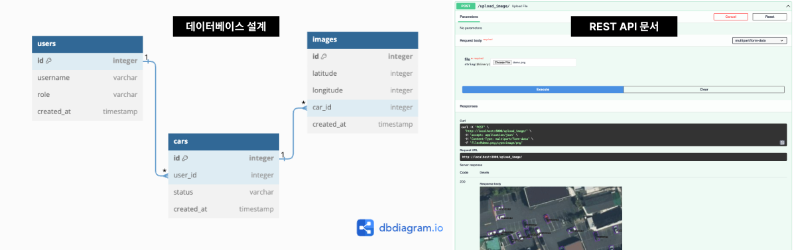
- 반응형 UI 개발 완료 및 다크모드 지원
  
- PWA(Progressive Web Apps) 지원 ([설치방법](https://github.com/ziweek/desirable-sea/tree/main?tab=readme-ov-file#pwa-%EC%84%A4%EC%B9%98%EB%B0%A9%EB%B2%95))
  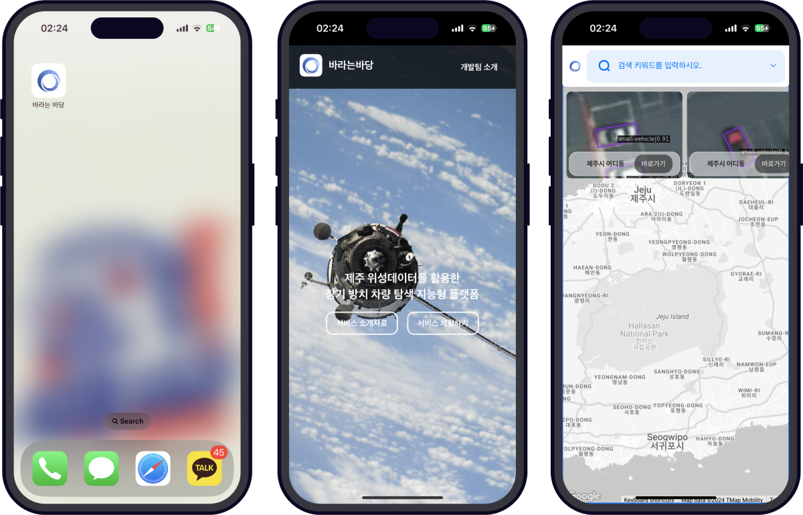

-->

# 3. 팀원

<table>
  <tr>
    <td width=80>
      <p align='center'>김지욱</p>
    </td>
    <td width=1=150>
      <p align='center'>
        
        <a href='https://github.com/ziweek' target="_blank">
          
        </a>
      </p>
    </td>
    <td>
      <p align='left'>
        이 프로젝트에 리더로 참여하여 먼저, 장기 방치 차량 문제에 직면해 이를 관리 하기 위한 지능형 플랫폼의 필요성을 깨닫게 되었습니다. Next.js, Google Map API, 그리고 FastAPI 등의 현대적인 기술들을 통합함으로써 우리의 솔루션은 효율적이고 사용자 친화적인 장기 방치 차량 관리를 실현하며, 위성데이터를 활용한 지능형 플랫폼의 발전에 일조하는 데 자부심을 느낄 수 있었습니다. 이 플랫폼은 제주의 차량문제를 혁신하고 미래 도시 계획에 기여하는 중요한 발판으로서의 역할을 할 것으로 기대됩니다.
      </p>
    </td>
  </tr>
  
   <tr>
    <td width=80>
      <p align='center'>부선웅</p>
    </td>
    <td width=150>
      <p align='center'>
        
        <a href='https://github.com/Boo-seon-woong' target="_blank">
          
        </a>
      </p>
    </td>
    <td>
      <p align='left'>
        CTO로 참여한 이 프로젝트는 최신 기술을 활용하여 제주의 장기 방치 차량 문제에 도전하는 흥미로운 경험이었습니다. 위성데이터와 딥러닝을 결합하여 차량을 정확하게 탐지하는 시스템을 개발하는 과정에서, 기술적인 도전과 혁신의 기회를 마주하게 되었습니다. 이 플랫폼은 미래 제주의 스마트한 지능형 시스템을 모색하는 데 있어 핵심적인 역할을 할 것으로 자부하고 있습니다.
      </p>
    </td>
  </tr>
</table>
