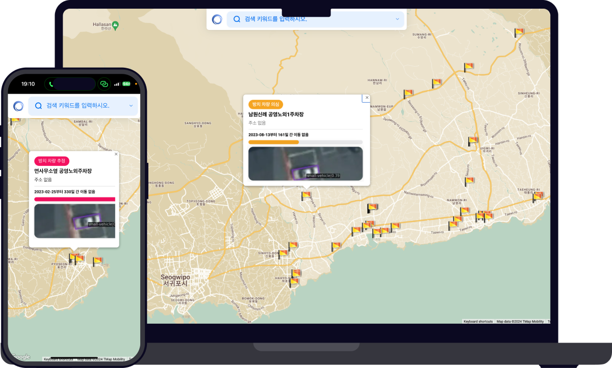
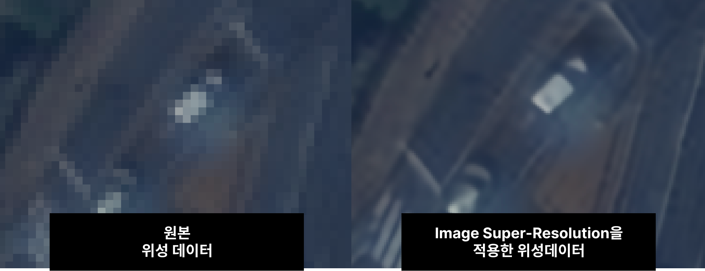
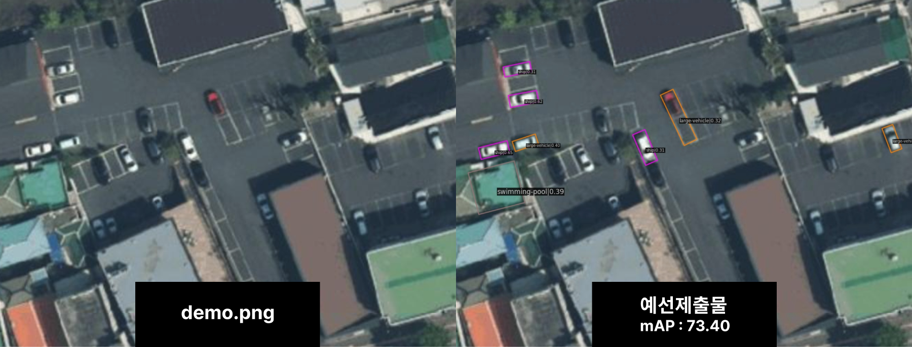
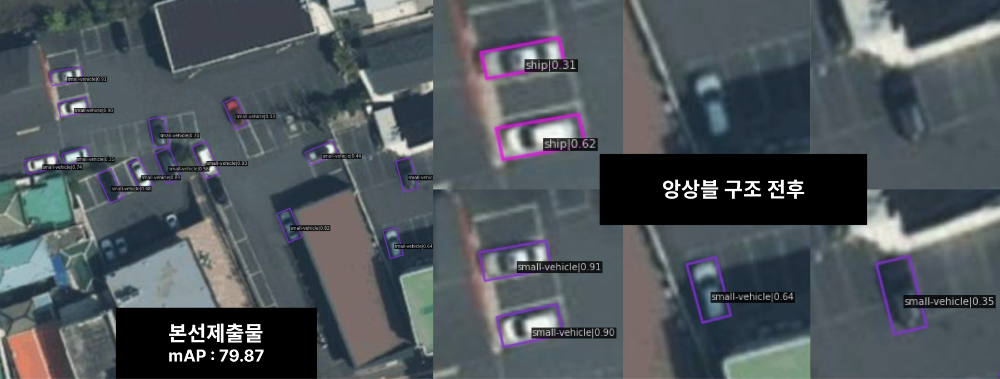
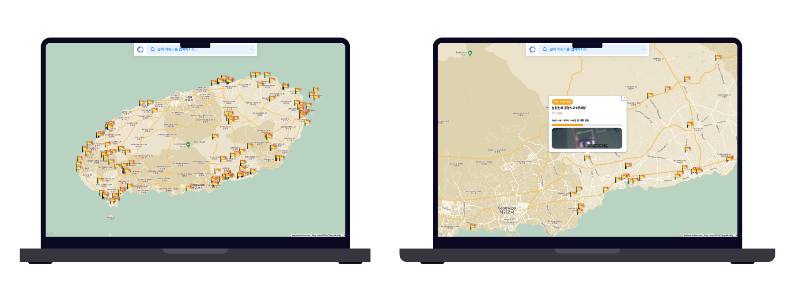
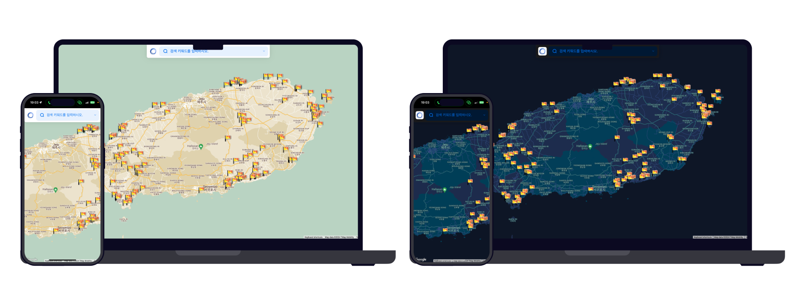

# Hello, Desirable Sea


<p align="center">
  <a href='https://github.com/ziweek/desirable-sea/blob/main/README_EN.md'>
    ENGLISH
  </a>
  &nbsp;|&nbsp;
  <a href='https://github.com/ziweek/desirable-sea/blob/main/README.md'>
    KOREAN
  </a>
  <br/>
  <br/>
  <strong>🏆 Grand Prize, in 2023 Jeju Island Satellite Data Utilization Competition 🏆</strong>
  <br/>
  <br/>
  <strong>Intelligent Platform for Long-Term Abandoned Vehicle Detection Utilizing Jeju Satellite Data</strong>
  <br/>
  <br/>

  <a href='https://paperswithcode.com/task/image-super-resolution'>
    
  </a>
  <a href='https://paperswithcode.com/task/object-detection-in-aerial-images'>
    
  </a><br/>
  <a href='https://github.com/XPixelGroup/HAT'>
    
  </a>
  <a href='https://github.com/xinntao/ESRGAN?tab=readme-ov-file'>
    
  </a>
  <a href='https://github.com/open-mmlab/mmrotate'>
    
  </a>
  <a href='https://github.com/ZFTurbo/Weighted-Boxes-Fusion'>
    
  </a>
  <br/>

  
   
  
  
  
  
  <br/>
  
  
  
  
  <br/>
  <br/>
  
  
  
</p>
<br/>
<br/>
  
<p align="center">  
  <strong>Check out prototypes in the badge below.<strong>
  <br/>
  <br/>
  <a href='https://www.canva.com/design/DAF6gh68bZ4/YeS-FN9gsbZpPdRnq52BXQ/view?utm_content=DAF6gh68bZ4&utm_campaign=designshare&utm_medium=link&utm_source=editor'>
    
  </a>
  <a href='https://desirable-sea.vercel.app/'>
    
  </a>
  <a href='https://colab.research.google.com/drive/13-VZyx3LiYPRS8aw-AcMSBK0Z4--TF2j?usp=sharing'>
    
  </a>
</p>

<br/>
<br/>

# 1. Introduction

> [!NOTE]
>
> - This idea is a project that was submitted to the [2023 Jeju Satellite Data Utilization Contest](https://aifactory.space/task/2700/overview) hosted by Jeju Special Self-Governing Province and won the Grand Prize (Jeju Special Self-Governing Province Governor Award).
> - This idea is to research and develop an intelligent platform that utilizes Jeju satellite data and applies computer vision object recognition AI technology to detect vehicles parked or abandoned for a long time in the Jeju area and to integrate and manage the information by related organizations.

<details>
 <summary><b>Why is it needed?</b></summary>
 There is serious issues caused surrounding parking lots in JeJu island. And also there are heavy traffic problems. 
</details>details>

https://github.com/ziweek/desirable-sea/assets/99459331/4a7edb47-754c-47fd-8dab-7d2adbb045ec

<table>
  <tr>
     <td>
      <p align='center'>
        Image Super Resolution
      </p>
    </td>
    <td>
      <p align='center'>
        Small Object Detection
      </p>
    </td>
    <td>
      <p align='center'>
        Prototype Web Application
      </p>
    </td>
  </tr>
   <tr>
    <td style="width:1/3;">
      
    </td>
    <td style="width:1/3;">
      
    </td>
    <td style="width:1/3;">
      
    </td>
  </tr>
</table>
<br/>

<br/>
<br/>

# 2. Implementation

<details>
 <summary><b>핵심기능</b></summary><br/>

### 1. Image Super Resolution

 <table>
  <tr>
     <td colspan=2>
      <p align="center">1.1 Image Super Resolution</p>
    </td>
  </tr>
   <tr>
     <td>
      
    </td>
  </tr>
   <tr>
    <td>
     <p align="left">소형 객체 탐지 모델의 성능을 개선하기 위해 전처리 모델로 XPixelGroup의 HAT라는 초고해상도 개선 모델을 도입하였습니다. 이를 통해 대회 측에서 제공한 위성이미지 데이터의 해상도를 4배 이상 개선할 수 있었습니다.</p>
    </td>
  </tr>
</table>
<br/>
<table>
  <tr>
     <td colspan=2>
      <p align="center">1.2 초고해상도 이미지 개선 딥러닝 모델</p>
    </td>
  </tr>
  <tr>
   <td align="center">

https://github.com/ziweek/desirable-sea/assets/99459331/2212ce20-bb1b-42f8-a97c-bebd22ce3fb3

</td>
    </tr>
      <tr>
     <td>
      <p align="left">초고해상도 개선 모델로 전처리된 데이터을 라벨링하였습니다. 이때, 사전 학습된 모델을 사용하여 자동으로 차량을 식별하게 하였습니다. 위의 영상은 사전 학습 모델이 식별하지 못한 예외적인 경우에 수작업으로 라벨링을 진행한 것입니다.</p>
    </td>
    </tr>
</table>

<br/>
<br/>

### 2. 소형 객체 탐지 딥러닝 모델

 <table>
  <tr>
     <td colspan=2>
      <p align="center">2.1 객체 탐지 딥러닝 모델 도입</p>
    </td>
  </tr>
   <tr>
     <td>
      
    </td>
  </tr>
     <tr>
    <td>
      <p align="left">MMRotate 프레임워크를 활용하여 위성이미지 데이터 내에서 차량 등의 객체를 식별할 수 있었습니다. 처음에는 사전 학습된 모델을 활용하여 성능지표를 평가하였습니다.</p>
    </td>
  </tr>
</table>
<br/>
 <table>
  <tr>
     <td colspan=2>
      <p align="center">2.2 Weighted Boxed Ensemble 앙상블 기법으로 성능 개선</p>
    </td>
  </tr>
    <tr>
     <td>
        
    </td>
  </tr>
    </tr>
    <tr>
     <td width="50%">
      <p align="left">소형 객체 탐지 모델의 성능을 개선하기 위하여, 추가적인 학습과 Weighted Boxed Ensemble 기법을 적용하였습니다. 그 결과, 이전에 식별한 차량에 대해서는 신뢰도가 대폭 상승한 것을 확인할 수 있었습니다. 뿐만 아니라, 이전에는 식별하지 못했던 유채색의 차량이나 주변 구조물의 그림자가 결쳐진 차량도 식별할 수 있었습니다.</p>
    </td>
  </tr>
</table>

<br/>
<br/>

### 3. 사용자 경험

 <table>
  <tr>
     <td colspan=2>
      <p align="center">3.1 Google Map API를 활용한 UX 구현</p>
    </td>
  </tr>
   <tr>
     <td>
      
    </td>
  </tr>
    <td>
     <p align="left">Google Map API를 활용하여 지도 기반의 인터페이스를 구현하였습니다. 이 덕분에 사용자는 제주도 전역에 위치한 공영주차장의 위치를 한눈에 파악할 수 있습니다. 뿐만 아니라, 추후에 경로 탐색 기능을 추가할 계획입니다.</p>
    </td>
  </tr>
  
</table>
<br/>
 <table>
  <tr>
     <td colspan=2>
      <p align="center">3.2 반응형 UI 및 다크모드 지원으로 사용성 개선</p>
    </td>
  </tr>
    <tr>
     <td>
       
    </td>
  </tr>
  <tr>
     <td width="50%">
      <p align="left">스마트폰, 태블릿, 또는 컴퓨터에서도 연속적인 사용자 경험을 전달할 수 있도록 반응형 웹디자인을 적용하였습니다. 또, 더 나아가 다크모드 디자인을 적용하였습니다.</p>
    </td>
  </tr>
</table>

<br/>
<br/>

</details>

<details >
  <summary><b>아키텍처</b></summary><br/>

### 프로덕트 아키텍처

 <table>
   <tr>
     <td>
      
    </td>
   </tr>
  <tr>
    <td>
     <p align="left">본 프로젝트의 서비스 아키텍처는 크게 4가지로 나눠서 살펴볼 수 있습니다.</p>
     <p> 1. 데이터 전처리 수행 서버</p>
     <ul>
      <li align="left">초고해상도 이미지 개선 딥러닝 모델</li>
      <li align="left">핵심 기능 수행 서버(소형 객체 식별 딥러닝 모델)</li>
      <li align="left">웹 어플리케이션(프론트엔드와 벡엔드 및 데이터베이스)</li>
     </ul>
     <p> 2. 핵심 기능 수행 서버</p>
     <ul>
      <li align="left">소형 객체 식별 딥러닝 모델</li>
      <li align="left">핵심 기능 수행 서버(소형 객체 식별 딥러닝 모델)</li>
      <li align="left">웹 어플리케이션(프론트엔드와 벡엔드 및 데이터베이스)</li>
     </ul>
     <p> 3. 웹 어플리케이션</p>
     <ul>
      <li align="left">프론트엔드</li>
      <li align="left">벡엔드</li>
      <li align="left">데이터베이스</li>
     </ul>
     <p> 4. 컨테이너화 및 배포 운영</p>
     <ul>
      <li align="left">프론트엔드</li>
      <li align="left">벡엔드</li>
      <li align="left">데이터베이스</li>
     </ul>
    </td>
  </tr>
</table>

<br/>
<br/>

### AI 아키텍처

 <table>
   <tr>
     <td>
      
    </td>
   </tr>
  <tr>
    <td>
     <p align="left">본 프로젝트의 AI 아키텍처는 크게 2가지로 나눠서 살펴볼 수 있습니다.</p>
     <p> 1. 초고해상도 이미지 개선 딥러닝 모델</p>
     <ul>
      <li>
       <details><summary><b>디렉토리 구조</b></summary>
        
```
ESRGAN
├── LR                      # Pytorch 모델을 저장하는 폴더입니다.
│   └── demo.png            # MVP 시연에 사용될 데모 이미지입니다.
├── models
│   ├── ...
│   └── RRDB_ESRGAN_x4.pth  # 베이스라인 관련 코드입니다.
├── ...
└── results
    └── demo_rlt.png        # 모델링 결과로 출력되는 이미지입니다.
```

</details></li>
<li><details><summary><b>초기 설치방법</b></summary>

```shell
# setup.sh 파일 만들기.
# 아래의 쉘스크립트 복사 후 붙여넣기.
# 터미널에서 setup.sh 실행

git clone https://github.com/xinntao/ESRGAN
cd ESRGAN

cd models
wget --load-cookies ~/cookies.txt \
"https://docs.google.com/uc?export=download&confirm=$(wget \
--quiet --save-cookies ~/cookies.txt \
--keep-session-cookies --no-check-certificate \
'https://docs.google.com/uc?export=download&id=1TPrz5QKd8DHHt1k8SRtm6tMiPjz_Qene' -O- \
| sed -rn 's/.*confirm=([0-9A-Za-z_]+).*/\1\n/p')&id=1TPrz5QKd8DHHt1k8SRtm6tMiPjz_Qene" -O RRDB_ESRGAN_x4.pth \
&& rm -rf ~/cookies.txt
cd ..

cd LR
wget https://raw.githubusercontent.com/ziweek/desirable-sea/main/src/demo.png
cd ..
```

</details></li>
<li><details ><summary><b>추론 실행방법</b></summary>

```shell
# 1. 아래의 쉘스크립트 복사 후 터미널에 붙여넣기.
# 2. 터미널에서 실행하기.
# 3. 동일 디렉토리 내에서 result-resolution.jpg 파일 확인하기.

python test.py
```

</details></li>
     </ul>
     <p> 2. 소형 객체 식별 딥러닝 모델</p>
     <ul>
      <li><details ><summary><b>디렉토리 구조</b></summary>
  
```
desirable-sea
├── checkpoints  # Pytorch 모델을 저장하는 폴더입니다.
├── mmrotate     # 베이스라인 관련 코드입니다.
│   ├── config
│   ├── ...
│   └── demo
├── ...
├── demo.png     # MVP 시연에 사용될 데모 이미지입니다.
└── result.jpg   # 모델링 결과로 출력되는 이미지입니다.
```
</details></li>
<li><details ><summary><b>초기 설치방법</b></summary>
 
```shell
# 1. setup.sh 파일 만들기.
# 2. 아래의 쉘스크립트 복사 후 붙여넣기.
# 3. 터미널에서 setup.sh 실행

sudo apt update
sudo apt -y install libgl1-mesa-glx

wget https://repo.anaconda.com/miniconda/Miniconda3-py37_4.9.2-Linux-x86_64.sh
chmod +x Miniconda3-py37_4.9.2-Linux-x86_64.sh
bash ./Miniconda3-py37_4.9.2-Linux-x86_64.sh -b -f -p /usr/local
which conda
conda --version

pip install torch==1.7.0+cu110 torchvision==0.8.1+cu110 torchaudio==0.7.0 -f https://download.pytorch.org/whl/torch_stable.html
pip install openmim --use-feature=2020-resolver
mim install mmcv-full==1.5.3
mim install mmdet==2.25.1

git clone https://github.com/open-mmlab/mmrotate.git
cd mmrotate
pip install -r requirements/build.txt
pip install -v -e .

cd ..

mkdir checkpoints
cd checkpoints
wget https://download.openmmlab.com/mmrotate/v0.1.0/redet/redet_re50_fpn_1x_dota_ms_rr_le90/redet_re50_fpn_1x_dota_ms_rr_le90-fc9217b5.pth
cd ..

wget https://raw.githubusercontent.com/ziweek/desirable-sea/main/src/demo.png

````
</details></li>
<li><details ><summary><b>추론 실행방법</b></summary>

```shell
# 1. 아래의 쉘스크립트 복사 후 터미널에 붙여넣기.
# 2. 터미널에서 실행하기.
# 3. 동일 디렉토리 내에서 result.jpg 파일 확인하기.

python mmrotate/demo/image_demo.py demo.png \
mmrotate/configs/redet/redet_re50_refpn_1x_dota_ms_rr_le90.py \
checkpoints/redet_re50_fpn_1x_dota_ms_rr_le90-fc9217b5.pth \
--out-file result.jpg
````

</details></li>
     </ul>
    </td>
  </tr>
</table>

</details>

<br/>
<br/>

<!--

## 2.2 초고해상도 이미지 개선 모델

<details >
  <summary><b>디렉토리 구조</b></summary>

```
ESRGAN
├── LR                      # Pytorch 모델을 저장하는 폴더입니다.
│   └── demo.png            # MVP 시연에 사용될 데모 이미지입니다.
├── models
│   ├── ...
│   └── RRDB_ESRGAN_x4.pth  # 베이스라인 관련 코드입니다.
├── ...
└── results
    └── demo_rlt.png        # 모델링 결과로 출력되는 이미지입니다.
```
</details>

<details >
  <summary><b>초기 설치방법</b></summary>

1. setup.sh 파일 만들기.
2. 아래의 쉘스크립트 복사 후 붙여넣기.
3. 터미널에서 setup.sh 실행


```shell

git clone https://github.com/xinntao/ESRGAN
cd ESRGAN

cd models
wget --load-cookies ~/cookies.txt "https://docs.google.com/uc?export=download&confirm=$(wget --quiet --save-cookies ~/cookies.txt --keep-session-cookies --no-check-certificate 'https://docs.google.com/uc?export=download&id=1TPrz5QKd8DHHt1k8SRtm6tMiPjz_Qene' -O- | sed -rn 's/.*confirm=([0-9A-Za-z_]+).*/\1\n/p')&id=1TPrz5QKd8DHHt1k8SRtm6tMiPjz_Qene" -O RRDB_ESRGAN_x4.pth && rm -rf ~/cookies.txt
cd ..

cd LR
wget https://raw.githubusercontent.com/ziweek/desirable-sea/main/src/demo.png
cd ..
```
</details>


<details >
  <summary><b>추론 실행방법</b></summary>

1. 아래의 쉘스크립트 복사 후 터미널에 붙여넣기.
2. 터미널에서 실행하기.
3. 동일 디렉토리 내에서 result-resolution.jpg 파일 확인하기.

```shell
python test.py
```


</details>

## 2.3 소형 객체 인식 모델


- 성능지표가 크게 개선됨. (mAP : 73.4 -> 78.9 )
  
- 기존의 결과값에 비해 정확도 및 신뢰도가 대폭 상승함. (ship 30% -> small vehicle 91%)
  
- 기존의 모델이 흰색 차량만을 식별했던 것과 달리 검은색, 검은색의 차량도 식별함.
  
- 건물의 그림자가 걸쳐진 차량도 식별함.
  


<details >
  <summary><b>디렉토리 구조</b></summary>

```
desirable-sea
├── checkpoints  # Pytorch 모델을 저장하는 폴더입니다.
├── mmrotate     # 베이스라인 관련 코드입니다.
│   ├── config
│   ├── ...
│   └── demo
├── ...
├── demo.png     # MVP 시연에 사용될 데모 이미지입니다.
└── result.jpg   # 모델링 결과로 출력되는 이미지입니다.
```
</details>

<details >
  <summary><b>초기 설치방법</b></summary>

1. setup.sh 파일 만들기.
2. 아래의 쉘스크립트 복사 후 붙여넣기.
3. 터미널에서 setup.sh 실행

```shell
# this code is written in Linux.

sudo apt update
sudo apt -y install libgl1-mesa-glx

wget https://repo.anaconda.com/miniconda/Miniconda3-py37_4.9.2-Linux-x86_64.sh
chmod +x Miniconda3-py37_4.9.2-Linux-x86_64.sh
bash ./Miniconda3-py37_4.9.2-Linux-x86_64.sh -b -f -p /usr/local
which conda
conda --version

pip install torch==1.7.0+cu110 torchvision==0.8.1+cu110 torchaudio==0.7.0 -f https://download.pytorch.org/whl/torch_stable.html
pip install openmim --use-feature=2020-resolver
mim install mmcv-full==1.5.3
mim install mmdet==2.25.1

git clone https://github.com/open-mmlab/mmrotate.git
cd mmrotate
pip install -r requirements/build.txt
pip install -v -e .

cd ..


mkdir checkpoints
cd checkpoints
wget https://download.openmmlab.com/mmrotate/v0.1.0/redet/redet_re50_fpn_1x_dota_ms_rr_le90/redet_re50_fpn_1x_dota_ms_rr_le90-fc9217b5.pth
cd ..

wget https://raw.githubusercontent.com/ziweek/desirable-sea/main/src/demo.png

```
</details>


<details >
  <summary><b>추론 실행방법</b></summary>

1. 아래의 쉘스크립트 복사 후 터미널에 붙여넣기.
2. 터미널에서 실행하기.
3. 동일 디렉토리 내에서 result.jpg 파일 확인하기.

```shell
python mmrotate/demo/image_demo.py demo.png mmrotate/configs/redet/redet_re50_refpn_1x_dota_ms_rr_le90.py checkpoints/redet_re50_fpn_1x_dota_ms_rr_le90-fc9217b5.pth --out-file result.jpg
```


</details>

## 2.4 웹 어플리케이션

- 공공데이터 포털에서 제공하는 [제주특별자치도_주차장기본정보](https://www.data.go.kr/data/15099715/openapi.do) 사용함.
  
- 서버와 데이터베이스 연동
  
- 반응형 UI 개발 완료 및 다크모드 지원
  
- PWA(Progressive Web Apps) 지원 ([설치방법](https://github.com/ziweek/desirable-sea/tree/main?tab=readme-ov-file#pwa-%EC%84%A4%EC%B9%98%EB%B0%A9%EB%B2%95))
  

-->

# 3. 팀원

<table>
  <tr>
    <td width=80>
      <p align='center'>김지욱</p>
    </td>
    <td width=1=150>
      <p align='center'>
        
        <a href='https://github.com/ziweek' target="_blank">
          
        </a>
      </p>
    </td>
    <td>
      <p align='left'>
        이 프로젝트에 리더로 참여하여 먼저, 장기 방치 차량 문제에 직면해 이를 관리 하기 위한 지능형 플랫폼의 필요성을 깨닫게 되었습니다. Next.js, Google Map API, 그리고 FastAPI 등의 현대적인 기술들을 통합함으로써 우리의 솔루션은 효율적이고 사용자 친화적인 장기 방치 차량 관리를 실현하며, 위성데이터를 활용한 지능형 플랫폼의 발전에 일조하는 데 자부심을 느낄 수 있었습니다. 이 플랫폼은 제주의 차량문제를 혁신하고 미래 도시 계획에 기여하는 중요한 발판으로서의 역할을 할 것으로 기대됩니다.
      </p>
    </td>
  </tr>
  
   <tr>
    <td width=80>
      <p align='center'>부선웅</p>
    </td>
    <td width=150>
      <p align='center'>
        
        <a href='https://github.com/Boo-seon-woong' target="_blank">
          
        </a>
      </p>
    </td>
    <td>
      <p align='left'>
        CTO로 참여한 이 프로젝트는 최신 기술을 활용하여 제주의 장기 방치 차량 문제에 도전하는 흥미로운 경험이었습니다. 위성데이터와 딥러닝을 결합하여 차량을 정확하게 탐지하는 시스템을 개발하는 과정에서, 기술적인 도전과 혁신의 기회를 마주하게 되었습니다. 이 플랫폼은 미래 제주의 스마트한 지능형 시스템을 모색하는 데 있어 핵심적인 역할을 할 것으로 자부하고 있습니다.
      </p>
    </td>
  </tr>
</table>
